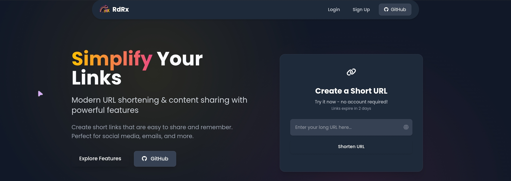
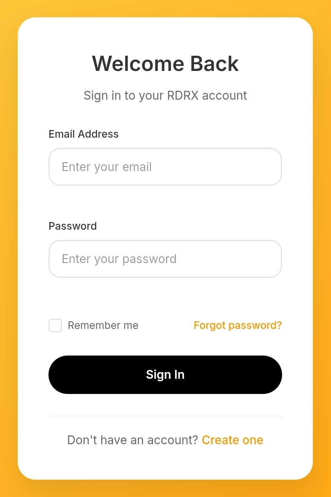
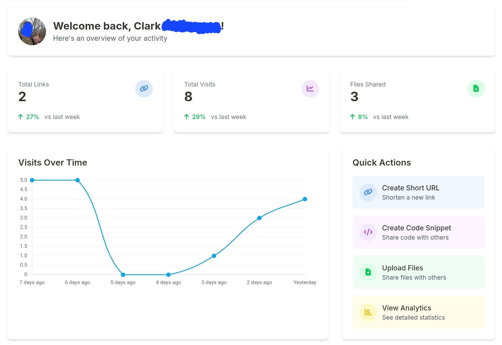
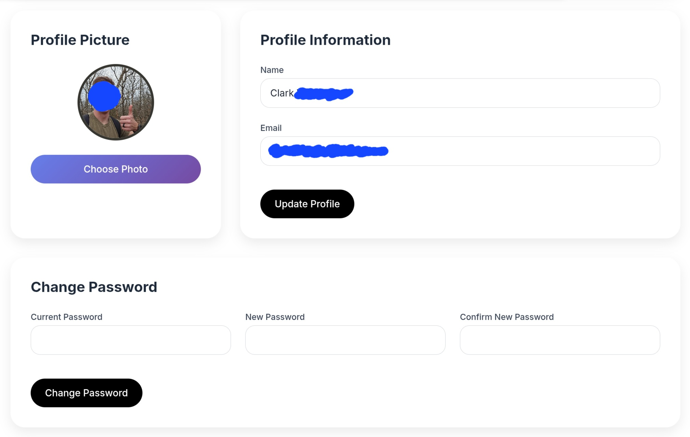
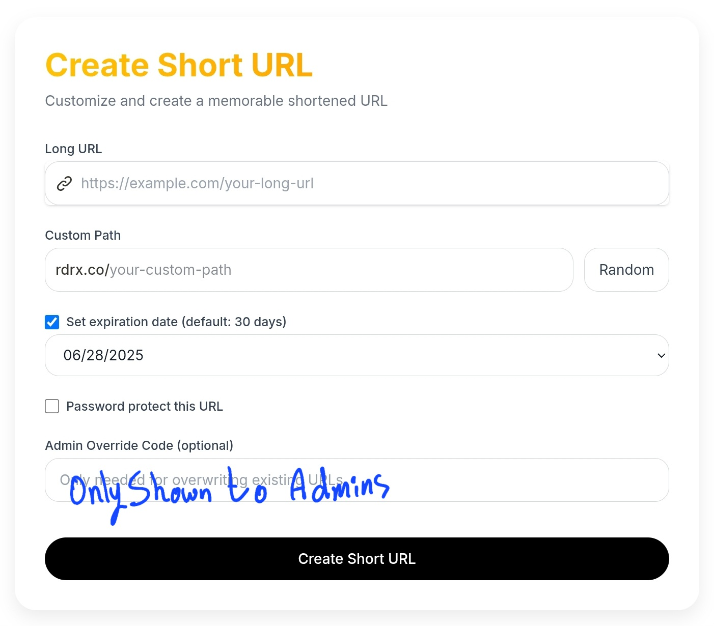
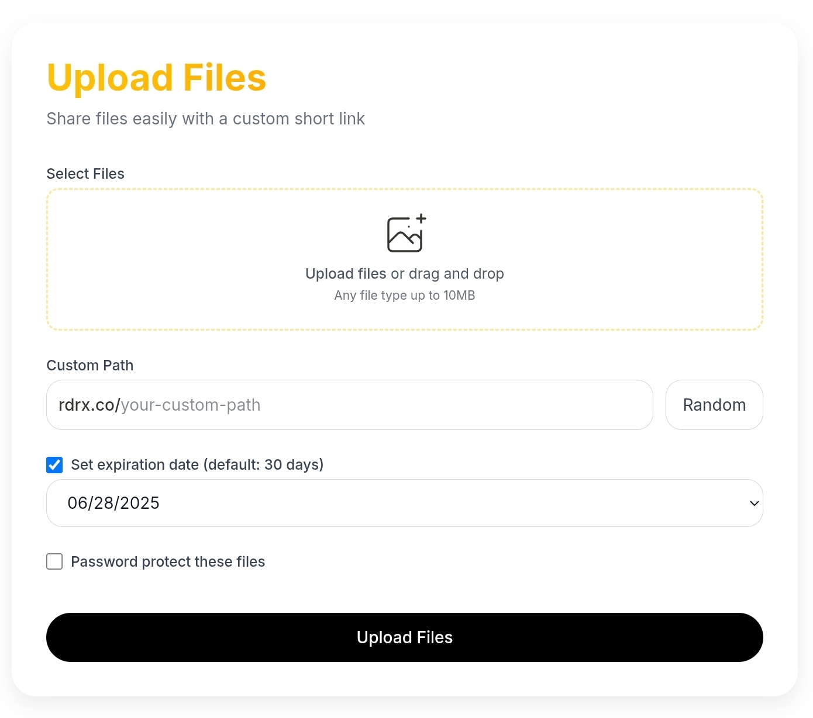

# RdRx URL Shortener

<div align="center">
  
  <h1>RdRx</h1>
  <p><strong>Modern URL Shortening & Content Sharing</strong></p>
</div>

<div align="center">
  <a href="CONTRIBUTING.md">Contributing</a> |
  <a href="https://github.com/clarkhacks/RdRx/stargazers">⭐ Star</a> |
  <a href="https://github.com/clarkhacks/RdRx/fork">🍴 Fork</a> |
  <a href="https://github.com/clarkhacks/RdRx/issues">🛠 Open Issue</a>
</div>

<div align="center">
  <a href="https://deploy.workers.cloudflare.com/?url=https://github.com/clarkhacks/RdRx">
    
  </a>
</div>

> **Note:** This project is in early development. Some features may require tinkering to work properly in your environment.

## 📸 Visual Features Showcase

<div align="center">
  <h3>🎯 Beautiful & Intuitive Interface</h3>
  <p>RdRx provides a modern, user-friendly experience for all your URL shortening and content sharing needs.</p>
</div>

<table align="center" style="border: none; border-collapse: collapse;">
  <tr style="border: none;">
    <td align="center" width="80%" style="border: none; padding: 10px;">
      <h4>🏠 Landing Page</h4>
      
      <p><em>Clean, modern landing page with intuitive navigation</em></p>
    </td>
    <td align="center" width="20%" style="border: none; padding: 10px;">
      <h4>🔐 Secure Authentication</h4>
      
      <p><em>Secure login with JWT-based authentication</em></p>
    </td>
  </tr>
  </table>
  <table align="center" style="border: none; border-collapse: collapse;">
  <tr style="border: none;">
    <td align="center" width="50%" style="border: none; padding: 10px;">
      <h4>📊 User Dashboard</h4>
      
      <p><em>Comprehensive dashboard with analytics and content management</em></p>
    </td>
    <td align="center" width="50%" style="border: none; padding: 10px;">
      <h4>👤 Profile Management</h4>
      
      <p><em>Easy profile management with customizable settings</em></p>
    </td>
  </tr>
  <tr style="border: none;">
    <td align="center" width="50%" style="border: none; padding: 10px;">
      <h4>🔗 URL Creation</h4>
      
      <p><em>Simple and powerful URL shortening with custom options</em></p>
    </td>
    <td align="center" width="50%" style="border: none; padding: 10px;">
      <h4>📁 File Upload</h4>
      
      <p><em>Drag-and-drop file sharing with gallery management</em></p>
    </td>
  </tr>
</table>

## 🚀 Quick Installation

### One-Click Install (Recommended)

Get RdRx up and running in minutes with our automated installation script:

```bash
# Set API token (if not already set)
export CLOUDFLARE_API_TOKEN=your_token_here

# Run one-click installation
curl -sSL https://raw.githubusercontent.com/clarkhacks/RdRx/main/install.sh | bash
```

This script will:

- ✅ Check prerequisites (Node.js, Git, Wrangler CLI)
- ✅ Clone the repository
- ✅ Prompt for your configuration (domain, email settings, etc.)
- ✅ Create all Cloudflare resources (D1 database, R2 bucket, KV namespace)
- ✅ Generate secure API keys and secrets
- ✅ Configure environment variables
- ✅ Deploy to Cloudflare Workers
- ✅ Provide you with all the information you need to get started

**Prerequisites for one-click install:**

- Node.js (v16+) - _will be installed automatically if missing_
- Git - _will be installed automatically if missing_
- A Cloudflare account (free tier works!)
- Cloudflare API Token (for non-interactive installation)

**Authentication Setup:**
Since the one-click install runs in a non-interactive environment, you'll need a Cloudflare API Token:

1. Go to [Cloudflare API Tokens](https://developers.cloudflare.com/fundamentals/api/get-started/create-token/)
2. Create a **Custom Token** with these permissions:
   - `Zone:Zone:Read` + `Account:Cloudflare Workers:Edit`
   - `Zone:Zone Settings:Read` + `Zone:Zone:Read`
   - `Account:D1:Edit` + `Account:R2:Edit`
   - `Account:Workers KV Storage:Edit`
3. Set the token as an environment variable:
   ```bash
   export CLOUDFLARE_API_TOKEN=your_token_here
   ```
4. Run the installation script

**Alternative: Local Installation**
If you prefer interactive browser login:

```bash
wget https://raw.githubusercontent.com/clarkhacks/RdRx/main/install.sh
chmod +x install.sh
./install.sh
```

### Manual Installation

If you prefer to install manually or want more control over the process, follow the detailed instructions below.

## Features

- **URL Shortening**: Create short, memorable links for any URL
- **Code Snippets**: Share code snippets with syntax highlighting
- **File Sharing**: Upload and share files securely
- **Password Protection**: Secure your links, snippets, and files with password protection
- **Analytics**: Track visits to your short links with detailed statistics
- **Content Editing**: Edit URLs, modify snippets, and manage files after creation
- **File Gallery Management**: Visual file gallery with add/remove capabilities and R2 storage integration
- **Custom Authentication**: Secure server-side authentication with JWT tokens
- **User Dashboard**: View your links, snippets, files, and analytics
- **Account Management**: Profile editing, password management, and profile pictures
- **Admin Panel**: Comprehensive admin interface for user and content management
- **Expiration**: Set links to expire after a specific time

## User Features

### Content Creation & Management

- **Create Short URLs**: Transform long URLs into short, shareable links
- **Code Snippet Sharing**: Share formatted code with syntax highlighting
- **File Upload & Sharing**: Upload multiple files and create shareable file bins
- **Password Protection**: Add password protection to any content type for enhanced privacy
- **Edit After Creation**: Modify URLs, update snippet content, and manage files
- **Delete Content**: Remove unwanted links, snippets, or files with proper cleanup

### File Management

- **Visual File Gallery**: Browse uploaded files with image thumbnails
- **Individual File Control**: Add or remove specific files from collections
- **Storage Integration**: Automatic R2 storage management with proper cleanup
- **File Type Support**: Support for images, documents, and various file types

### Analytics & Tracking

- **Detailed Analytics**: View click statistics, geographic data, and visit trends
- **Real-time Data**: Live tracking of link performance
- **Export Capabilities**: Download analytics data for external analysis
- **User-specific Analytics**: Track only your own content performance

### Account Features

- **Secure Authentication**: JWT-based authentication with HTTP-only cookies
- **Profile Management**: Update personal information and profile pictures
- **Password Security**: Secure password hashing with PBKDF2 and salt
- **Email Integration**: Password reset functionality via Mailgun

## Admin Features

### User Management

- **User Overview**: View all registered users with search and filtering
- **Account Control**: Create, edit, verify, and delete user accounts
- **Bulk Operations**: Manage multiple users efficiently
- **Security Monitoring**: Track user activity and authentication status

### Content Administration

- **URL Management**: View, edit, and delete all shortened URLs
- **Content Moderation**: Monitor and manage user-generated content
- **File Administration**: Manage uploaded files with R2 storage integration
- **Bulk Content Operations**: Efficiently manage large amounts of content

### System Analytics

- **Platform Statistics**: Overall system usage and performance metrics
- **Storage Monitoring**: R2 storage usage and file management statistics
- **User Analytics**: Platform-wide user engagement and activity data
- **Performance Tracking**: Monitor system health and response times

## Prerequisites

- [Node.js](https://nodejs.org/) (v16 or later)
- [npm](https://www.npmjs.com/) or [pnpm](https://pnpm.io/)
- [Wrangler CLI](https://developers.cloudflare.com/workers/wrangler/install-and-update/)
- A [Cloudflare](https://www.cloudflare.com/) account

## Step-by-Step Installation Guide

### 1. Clone the Repository

```bash
git clone https://github.com/clarkhacks/RdRx.git
cd RdRx
```

### 2. Install Dependencies

```bash
npm install
# or
pnpm install
```

### 3. Cloudflare Setup

#### 3.1. Log in to Cloudflare

```bash
npx wrangler login
```

Follow the prompts to authenticate with your Cloudflare account.

#### 3.2. Create a D1 Database

```bash
npx wrangler d1 create rdrx-shorturls
```

This will output a database ID. Copy this ID for the next step.

#### 3.3. Create an R2 Bucket

```bash
npx wrangler r2 bucket create rdrx-files
```

#### 3.4. Create a KV Namespace

```bash
npx wrangler kv:namespace create KV_RDRX
npx wrangler kv:namespace create KV_RDRX --preview
```

Copy the IDs from these commands for the next step.

### 4. Configure Your Project

#### 4.1. Update wrangler.toml

Edit your `wrangler.toml` file to include the database, bucket, and KV namespace information:

```toml
name = "rdrx"
main = "src/index.ts"
compatibility_date = "2024-12-05"
compatibility_flags = ["nodejs_compat"]

[vars]
FRONTEND_URL = "http://localhost:8787"
SHORT_DOMAIN = "your-domain.com"
MAILGUN_DOMAIN = "your-domain.com"
FROM_EMAIL = "no-reply@your-domain.com"
R2_URL = "https://cdn.your-domain.com"

[observability]
enabled = true

[triggers]
crons = ["0 0 * * *"]

[[d1_databases]]
binding = "DB"
database_name = "rdrx-shorturls"
database_id = "YOUR_DATABASE_ID" # Replace with your actual database ID

[[kv_namespaces]]
binding = "KV_RDRX"
id = "YOUR_KV_NAMESPACE_ID" # Replace with your actual KV namespace ID
preview_id = "YOUR_KV_NAMESPACE_PREVIEW_ID" # Replace with your actual preview ID

[[r2_buckets]]
binding = "R2_RDRX"
bucket_name = "rdrx-files"
```

#### 4.2. Set Up Environment Variables

Create a `.dev.vars` file in the project root with your configuration:

```
API_KEY="your-api-key-here"
API_KEY_ADMIN="your-admin-api-key-here"
ADMIN_UID="your-admin-user-id-here"

# Domain Configuration
SHORT_DOMAIN="your-domain.com"
R2_URL="https://cdn.your-domain.com"

# Authentication
JWT_SECRET="your-super-secret-jwt-key-here-make-it-long-and-random"
MAILGUN_API_KEY="key-1234567890abcdef1234567890abcdef"

# Optional: Disable user signups (set to "true" to disable) THIS IS SET TO TRUE FOR THE RDRX.CO VERSION IN THIS REPO
DISABLE_SIGNUPS="false"
```

**Important Domain Configuration:**

- `SHORT_DOMAIN`: The domain used for your shortened URLs (e.g., "example.com" will create links like "https://example.com/abc123")
- `R2_URL`: The URL where your R2 bucket serves static files (logos, favicons, uploaded files)
- These variables make the application fully configurable for your own domain instead of being hardcoded to "rdrx.co"

### 5. Initialize the Database

Create a file called `schema.sql` in the project root with the following content:

```sql
-- Create short_urls table
CREATE TABLE IF NOT EXISTS short_urls (
  id INTEGER PRIMARY KEY AUTOINCREMENT,
  shortcode TEXT NOT NULL UNIQUE,
  target_url TEXT NOT NULL,
  created_at TEXT NOT NULL,
  creator_id TEXT,
  is_snippet BOOLEAN NOT NULL DEFAULT 0,
  is_file BOOLEAN NOT NULL DEFAULT 0,
  password_hash TEXT,
  is_password_protected BOOLEAN NOT NULL DEFAULT 0
);

-- Create analytics table
CREATE TABLE IF NOT EXISTS analytics (
  id INTEGER PRIMARY KEY AUTOINCREMENT,
  shortcode TEXT NOT NULL,
  target_url TEXT NOT NULL,
  country TEXT,
  timestamp TEXT NOT NULL
);

-- Create deletions table
CREATE TABLE IF NOT EXISTS deletions (
  id INTEGER PRIMARY KEY AUTOINCREMENT,
  shortcode TEXT NOT NULL,
  delete_at INTEGER NOT NULL,
  is_file BOOLEAN NOT NULL DEFAULT 0,
  created_at TEXT NOT NULL
);

-- Create users table
CREATE TABLE IF NOT EXISTS users (
  id INTEGER PRIMARY KEY AUTOINCREMENT,
  uid TEXT NOT NULL UNIQUE,
  email TEXT NOT NULL UNIQUE,
  name TEXT NOT NULL,
  password_hash TEXT NOT NULL,
  salt TEXT NOT NULL,
  email_verified BOOLEAN NOT NULL DEFAULT 0,
  created_at TEXT NOT NULL,
  updated_at TEXT NOT NULL,
  profile_picture_url TEXT
);

-- Create sessions table
CREATE TABLE IF NOT EXISTS sessions (
  id INTEGER PRIMARY KEY AUTOINCREMENT,
  session_id TEXT NOT NULL UNIQUE,
  user_id TEXT NOT NULL,
  created_at TEXT NOT NULL,
  expires_at TEXT NOT NULL
);
```

Then run:

```bash
npx wrangler d1 execute rdrx-shorturls --file=./schema.sql
```

### 6. Run the Development Server

```bash
npm run dev
# or
pnpm dev
```

Visit `http://localhost:8787` to see your application.

### 7. Deploy to Production

```bash
npm run deploy
# or
pnpm deploy
```

For production, set your environment variables in the Cloudflare Dashboard or using Wrangler:

```bash
npx wrangler secret put JWT_SECRET
npx wrangler secret put MAILGUN_API_KEY
npx wrangler secret put ADMIN_UID
# etc.
```

## Admin Setup

To access the admin panel:

1. Create your user account through the normal registration process
2. Note your user ID (UID) from the account page or database
3. Set the `ADMIN_UID` environment variable to your user ID:

   ```bash
   # For local development
   echo "ADMIN_UID=your-user-id-here" >> .dev.vars

   # For production
   npx wrangler secret put ADMIN_UID
   ```

4. Restart your application
5. The admin panel link will appear in your sidebar navigation

## API Endpoints

### User Content Management

- `PUT /api/user/url/{shortcode}` - Update URL target
- `GET /api/user/snippet/{shortcode}` - Get snippet content
- `PUT /api/user/snippet/{shortcode}` - Update snippet content
- `GET /api/user/files/{shortcode}` - Get file list
- `DELETE /api/user/files/{shortcode}/{filename}` - Remove specific file
- `POST /api/user/files/{shortcode}/upload` - Add files to collection
- `DELETE /api/user/delete/{shortcode}` - Delete entire item

### Admin API

- `GET /api/admin/users` - List all users
- `POST /api/admin/users` - Create new user
- `DELETE /api/admin/users/{id}` - Delete user
- `GET /api/admin/urls` - List all URLs
- `PUT /api/admin/urls/{shortcode}` - Update URL
- `DELETE /api/admin/urls/{shortcode}` - Delete URL
- `GET /api/admin/stats` - System statistics
- `GET /api/admin/analytics` - Platform analytics

## Troubleshooting

### Authentication Issues

If you encounter authentication issues:

1. Check that your JWT_SECRET is properly set in your environment variables
2. Ensure cookies are being properly set (check browser dev tools)
3. Verify that your R2 bucket is properly configured for profile picture uploads
4. Check server logs for detailed error messages

### Admin Panel Access

If you can't access the admin panel:

1. Verify your ADMIN_UID is set correctly in environment variables
2. Ensure your user account exists and you're logged in
3. Check that the UID matches exactly (case-sensitive)
4. Restart the application after setting the ADMIN_UID

### Database Issues

If you encounter database issues:

1. Verify your D1 database is properly configured in wrangler.toml
2. Check that all tables were created successfully
3. Try running the schema.sql file again to ensure all tables exist
4. Verify the `email_verified` column exists in the users table

### File Upload Issues

If file uploads aren't working:

1. Check R2 bucket configuration in wrangler.toml
2. Verify R2 bucket permissions
3. Ensure the bucket name matches in your configuration
4. Check browser console for upload errors

### Deployment Issues

If you encounter issues during deployment:

1. Ensure your Wrangler CLI is up to date: `npm install -g wrangler@latest`
2. Verify your Cloudflare authentication: `npx wrangler whoami`
3. Check your `wrangler.toml` configuration
4. Make sure all required environment variables are set as secrets

## Project Structure

```
rdrx-shorturls/
├── src/                  # Source code
│   ├── components/       # UI components
│   │   ├── auth/         # Authentication components
│   │   ├── layouts/      # Layout components
│   │   ├── pages/        # Page components
│   │   └── ui/           # UI components
│   ├── helpers/          # Helper functions
│   ├── middleware/       # Middleware functions
│   ├── routes/           # Route handlers
│   │   ├── admin.ts      # Admin API routes
│   │   ├── user.ts       # User content management routes
│   │   └── ...           # Other route handlers
│   ├── utils/            # Utility functions
│   ├── index.ts          # Entry point
│   └── types.ts          # TypeScript types
├── test/                 # Tests
├── static/               # Static assets
├── .dev.vars             # Development environment variables
├── package.json          # Dependencies and scripts
├── tsconfig.json         # TypeScript configuration
├── wrangler.toml         # Wrangler configuration
└── README.md             # This file
```

## Available Scripts

- `npm run dev` - Start the development server
- `npm run deploy` - Deploy to Cloudflare Workers
- `npm run test` - Run tests
- `npm run cf-typegen` - Generate TypeScript types for Cloudflare bindings
- `npm run format` - Format code with Prettier

## Authentication System

The application uses a custom server-side authentication system with the following features:

- **JWT Tokens**: Secure authentication using JSON Web Tokens
- **HTTP-Only Cookies**: Tokens are stored in secure, HTTP-only cookies for maximum security
- **Password Hashing**: PBKDF2 with salt for secure password storage
- **Account Management**: Users can update their profile, change passwords, and upload profile pictures
- **Email Integration**: Password reset via email using Mailgun
- **Admin Authentication**: Role-based access control for administrative functions

## Security Features

- **Environment Variable Secrets**: Sensitive data stored as Cloudflare Worker secrets
- **User Ownership Verification**: Users can only edit their own content
- **Admin Role Protection**: Admin functions require specific user ID verification
- **Secure File Handling**: Proper R2 storage management with cleanup
- **Input Validation**: Comprehensive validation for all user inputs
- **CSRF Protection**: Secure form handling and API endpoints

## License

This project is licensed under the GPL-3.0 License. See the [LICENSE](LICENSE) file for details.
