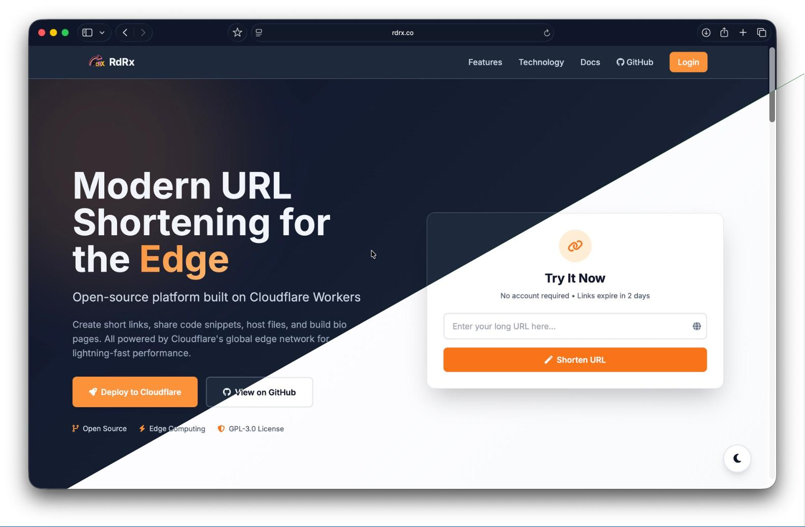
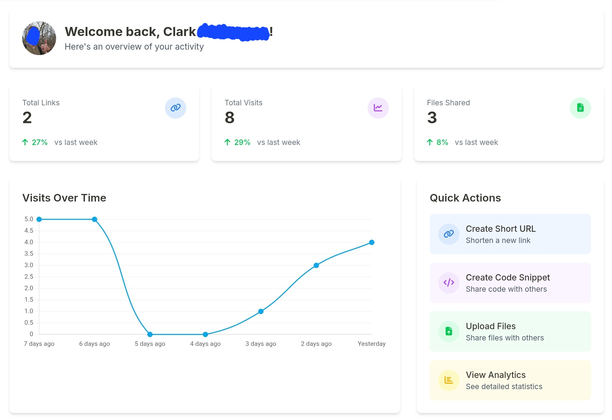

# RdRx URL Shortener

<div align="center">
  
  <h1>RdRx</h1>
  <p><strong>Modern URL Shortening & Content Sharing Platform</strong></p>
  <p>Built with Cloudflare Workers, D1, R2, and KV</p>
</div>

<div align="center">
  <a href="https://deploy.workers.cloudflare.com/?url=https://github.com/clarkhacks/RdRx">
    
  </a>
</div>

<br>

## 📚 Documentation

**Complete documentation is available at [/static/docs](/static/docs)** or visit the live docs site.

Quick links:
- [Getting Started](static/docs/getting-started.md) - Installation and setup
- [Deployment Guide](static/docs/deployment.md) - Production deployment
- [API Documentation](static/docs/api/README.md) - REST API reference
- [Development Guide](static/docs/development/README.md) - Architecture and contributing
- [Changelog](static/docs/changelog.md) - Version history

## 🚀 Quick Start

### One-Click Install

```bash
curl -sSL https://raw.githubusercontent.com/clarkhacks/RdRx/main/install.sh | bash
```

### Manual Install

```bash
# Clone and install
git clone https://github.com/clarkhacks/RdRx.git
cd RdRx
pnpm install

# Configure
cp .dev.vars.example .dev.vars
# Edit .dev.vars with your settings

# Set up Cloudflare resources
wrangler d1 create rdrx-db
wrangler r2 bucket create rdrx-files
wrangler kv:namespace create rdrx-kv

# Initialize database
wrangler d1 execute rdrx-db --file=./schema.sql

# Run development server
pnpm dev
```

Visit `http://localhost:8787` to see your RdRx instance!

## ✨ Features

- **URL Shortening** - Create short, memorable links
- **Code Snippets** - Share code with syntax highlighting
- **File Sharing** - Upload and share files securely
- **Bio Pages** - Create custom landing pages (like Linktree)
- **Analytics** - Track link performance and visitor data
- **Password Protection** - Secure your links with passwords
- **Scheduled Deletion** - Auto-delete links after a specified time
- **API Access** - Programmatic access via REST API
- **Admin Panel** - Comprehensive admin interface
- **User Dashboard** - Manage all your content in one place

## 📸 Screenshots

<table align="center">
  <tr>
    <td align="center" width="50%">
      
      <p><em>Clean, modern landing page</em></p>
    </td>
    <td align="center" width="50%">
      
      <p><em>Comprehensive user dashboard</em></p>
    </td>
  </tr>
</table>

## 🛠 Technology Stack

- **Runtime**: Cloudflare Workers
- **Database**: Cloudflare D1 (SQLite)
- **Storage**: Cloudflare R2
- **Cache**: Cloudflare KV
- **Language**: TypeScript
- **Build Tool**: Wrangler

## 📖 Documentation Structure

```
static/docs/
├── README.md              # Documentation home
├── getting-started.md     # Quick start guide
├── deployment.md          # Production deployment
├── api-keys.md           # API key management
├── changelog.md          # Version history
├── contributing.md       # Contribution guidelines
├── code-of-conduct.md    # Community guidelines
├── production-ready.md   # Production checklist
├── api/                  # API documentation
│   └── README.md         # REST API reference
└── development/          # Development docs
    ├── README.md         # Architecture guide
    ├── refactoring-plan.md
    ├── phase1-summary.md
    ├── phase2-plan.md
    ├── ui-improvements.md
    └── security-improvements.md
```

## 🤝 Contributing

We welcome contributions! Please see our [Contributing Guide](static/docs/contributing.md) for details.

## 📄 License

This project is licensed under the GPL-3.0 License. See the [LICENSE](LICENSE) file for details.

## 🔗 Links

- [Documentation](/static/docs)
- [GitHub Repository](https://github.com/clarkhacks/RdRx)
- [Issues](https://github.com/clarkhacks/RdRx/issues)
- [Discussions](https://github.com/clarkhacks/RdRx/discussions)

## ⭐ Support

If you find RdRx useful, please consider:
- ⭐ [Starring the repository](https://github.com/clarkhacks/RdRx/stargazers)
- 🐛 [Reporting issues](https://github.com/clarkhacks/RdRx/issues)
- 💬 [Joining discussions](https://github.com/clarkhacks/RdRx/discussions)
- 🍴 [Contributing code](static/docs/contributing.md)
